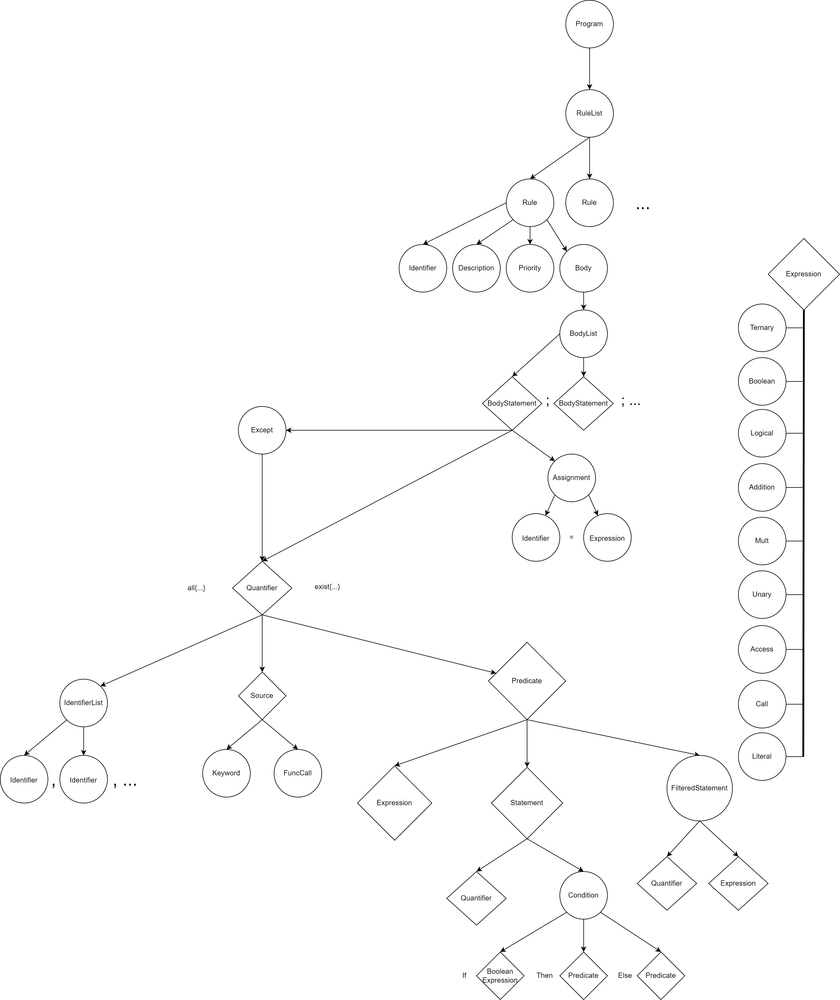

# Описание языка

## AST



## Основные конструкции языка

Основной конструкцией языка является правило - rule:

```
rule "<name>" {

}
```

У правила должны быть следующие параметры:

```
1. description: "<text>" - описание правила
2. priority: Info|Warn|Error - по умолчанию ERROR
```

## Сущности

Далее идут сущности языка:

1. system
2. container
3. component
4. code
5. deploy
6. infrastructure
7. none

Эти множества согласованы с моделью C4 и содержат все такие компоненты в модели.
чтобы выбрать элемент из этого множества можно написать следующее

```
s in system

s1, s2 in system

```

По умолчанию все элементы в языке являются уникальными

## Кванторы

При описании правила необходимо написать квантор для указания диапазона элементов

```

all {

    s in system

}

  

exist {

    s in system

}

```

Подобные запросы могут быть вложенными

```

all {

    s in system: exist { c in s: ... }

}

```

Все объекты связанные с работой над основными сущностями являются множествами. И модификаторы ограничивают эти множества

После двоеточия идет предикат. Также на одном уровне можно делать выборку из разных слоев C4

## Выражения

Язык содержит следующие выражения

```
1. if <expr> then <expr> else <expr> - тернарный оператор
2. <item>.<prop> - нет строго требования к существованию свойства элемента 
3. <item>.!<prop> - строгая политика к существованию элемента
4. <item>.<prop> in list - посмотреть, что элемент в содержится в списке
5. булевые операторы - not, and, or, xor, >, <, >=, <=, ==, /=
```

## Функции

Язык содержит специальные функции для обработки сложной логики:
```
1. route( <item1>, <item2> ) - проверка, что связь существует между двумя списками
2. <item> in route( <item1>, <item2> )- связь осуществляется через такой-то узел
3. cross(<set1>, <set2>) - пересечение двух множеств
4. union(<set1>, <set2>) - объединение двух множеств
5. instance(<item>) - просмотр инстансов для элемента
6. failure_point(<set>) - проверка на точку отказа
```

## Управляющие конструкции

``except <квантор>`` - исключение из правила
``if <expr> then <квантор> else <квантор>``- проверка условия
``<name> = number|string|bool`` - объявление переменной
``<name> = [number|string|bool]`` - создание множества
